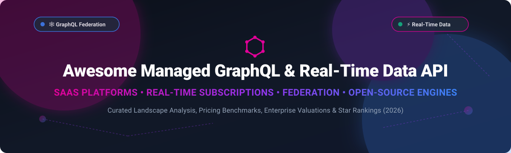

  

# 🚀 Managed GraphQL & Real-Time Data API Platforms (2026 Ecosystem Guide) 🌐

  
  
  
  
  

A curated catalog and landscape analysis of **Managed GraphQL Cloud Services** ☁️, **Real-Time Data API Platforms** ⚡, **Federation Engines** 🕸️, and **Open-Source GraphQL Frameworks** 🛠️. 

Whether you are building high-throughput microservices 🏗️, real-time WebSocket subscriptions 🔌, or federating distributed enterprise data graphs 🌐, this guide compares top commercial platforms and open-source solutions by pricing 💰, enterprise valuation 📈, GitHub_Stars ⭐, and architectural features 🏛️.

---

## 📑 Table of Contents
- [📊 Market Overview & Ecosystem Dynamics](#-market-overview--ecosystem-dynamics)
- [☁️ Managed & SaaS GraphQL Platforms](#️-managed--saas-graphql-platforms)
- [🔓 Open-Source GraphQL Engines & Frameworks](#-open-source-graphql-engines--frameworks)
- [🏛️ Architecture & Platform Comparison Guidelines](#️-architecture--platform-comparison-guidelines)
- [🤝 How to Contribute](#-how-to-contribute)
- [💖 Support & Sponsorship](#-support--sponsorship)
- [📈 Star History](#-star-history)
- [⚠️ Disclaimer](#️-disclaimer)

---

## 📊 Market Overview & Ecosystem Dynamics

The global GraphQL and API Management market is estimated at **$2.8 Billion in 2026** 📈 and is projected to reach **$6.5 Billion by 2030** (CAGR ~23.4%). 

The managed GraphQL sector is **moderately fragmented** 🧩:
- ☁️ **Public Cloud Leaders & Database Platforms** (AWS AppSync, Supabase) dominate infrastructure-level managed APIs through deep ecosystem integration and scale.
- 🕸️ **Enterprise Federation Specialists** (Apollo GraphQL, WunderGraph) capture high-margin enterprise supergraph routing and governance workloads.
- 🎯 **Niche & Headless Data Engines** (Hasura, Hygraph, Dgraph) serve specialized developer niches like database-to-GraphQL automation and content federation.

---

## ☁️ Managed & SaaS GraphQL Platforms

Commercial managed GraphQL platforms sorted by company scale (Valuation / Revenue descending):

| Platform | Company Scale (Valuation / Revenue) | Starting Paid Tier Pricing 💰 | Free Tier / Trial Limits 🎁 | Core Capabilities & Focus 🎯 |
| :--- | :--- | :--- | :--- | :--- |
| **[AWS AppSync](https://aws.amazon.com/appsync/)** ☁️ | **~$1.7 Trillion** (AWS / Amazon Market Cap) | Pay-as-you-go: **$4.00 per million** query/mutation ops, **$0.08 per million** connection-mins, **$2.00 per million** updates | 12-Month Free Tier: **250,000** query/mutation ops, **250,000** updates, **600,000** connection-mins/month | Serverless managed GraphQL & Pub/Sub WebSocket channels on AWS. Best for AWS-native workloads. |
| **[Supabase GraphQL](https://supabase.com/docs/guides/graphql)** ⚡ | **$10.5 Billion** Valuation (Series F, 2026) | Pro Plan starts at **$25/month** + usage-based compute | Free Forever: **500MB** database storage, **5GB** bandwidth, **50,000** monthly active users | Instant GraphQL API for PostgreSQL powered by `pg_graphql`. Mirrors SQL schema with automatic types. |
| **[Apollo GraphOS](https://www.apollographql.com/)** 🕸️ | **$1.5 Billion+** Valuation (Series D) | Enterprise / Serverless Pay-as-you-go starts at **$49/month** (Professional) | Serverless Free Plan: **50 Million** operation units per month free | Enterprise GraphQL supergraph platform, schema registry, federation routing, and observability. |
| **[Hasura Cloud](https://hasura.io/)** 🚀 | **$1.0 Billion** Valuation (Series C) | Professional Plan starts at **$99/month** (includes 20M operations) | Free Tier: **100,000** requests/month and **1 GB** data pass-through | Instant GraphQL & REST APIs over databases with real-time subscriptions, JWT auth, and row-level security. |
| **[Hygraph](https://hygraph.com/)** 📰 | **~$43.7 Million** Total Funding (~$15M Revenue) | Self-Serve Starter/Professional starts at **$199/month** | Free Forever Community Plan: **5 projects**, **1M API operations/month**, **100GB** asset bandwidth | GraphQL-native structured content platform (headless CMS) with multi-source Content Federation. |
| **[StepZen](https://stepzen.com/)** (IBM) 💼 | Acquired by **IBM** ($180B+ Market Cap) | Pay-as-you-go integrated via IBM Cloud / StepZen deployment tiers | Free Developer Tier: **100,000** API calls/month free | Declarative GraphQL gateway engine building GraphQL APIs from REST, SQL databases, and gRPC endpoints. |
| **[Dgraph Cloud](https://dgraph.io/)** 🕸️ | Acquired by **Istari Digital** / Hypermode ($24M Funding) | Dedicated Cloud Tiers starting from **$49/month** | Free Tier: **1M** GraphQL operations/month with 5MB dataset limit | Managed GraphQL-native graph database with real-time subscriptions and GraphQL+- query engine. |
| **[WunderGraph Cloud](https://wundergraph.com/)** 🛠️ | **$10.5 Million** Total Funding (Series A, 2025) | Team / Pro Plan starts at **$25/month** | Free Developer Tier: **1 Million** requests/month and 1 project included | Managed Cosmo federation platform, high-performance Go router, composition checks, and schema registry. |
| **[Prisma Data Platform](https://www.prisma.io/)** 💎 | Private (~$40M+ Funding) | Accelerate / Pulse tiers start at **$15/month** | Free Developer Tier: **60,000** requests/month and **1,000** real-time event notifications | Managed Data Proxy for connection pooling, caching, and real-time database events for Prisma ORM. |

---

## 🔓 Open-Source GraphQL Engines & Frameworks

Top open-source GraphQL repositories, server frameworks, and federation routers sorted by **GitHub Stars_Count** ⭐ (descending):

| Repository / Project | GitHub_Stars & Link ⭐ | License 📄 | Primary Stack / Ecosystem 💻 | Key Architectural Highlights 🏛️ |
| :--- | :--- | :--- | :--- | :--- |
| **Hasura Engine** 🚀 |  | Apache-2.0 | Haskell / C++ | Instant GraphQL and REST APIs over PostgreSQL, MySQL, and SQL Server with real-time WebSocket subscriptions. |
| **Dgraph** 🕸️ |  | Apache-2.0 | Go | Distributed, transactional GraphQL-native graph database with built-in subscription support. |
| **GraphQL.js** 🟨 |  | MIT | JavaScript / Node.js | The reference implementation of the GraphQL specification for JavaScript. |
| **Apollo Server** 🕸️ |  | MIT | TypeScript / Node.js | Production-ready spec-compliant GraphQL server with first-class support for Apollo Federation. |
| **PostGraphile** 🐘 |  | MIT | Node.js / PostgreSQL | Extensible GraphQL API generator from PostgreSQL schemas using row-level security and high-performance compilation. |
| **gqlgen** 🐹 |  | MIT | Go | Code-generation based GraphQL server library for building type-safe GraphQL servers in Go. |
| **GraphQL Go** 🔷 |  | MIT | Go | An implementation of GraphQL for Go programming language. |
| **GraphQL Yoga** 🧘 |  | MIT | TypeScript / Node.js | Fully-featured, lightweight GraphQL server built on Envelop plugins and W3C fetch standards. |
| **Graphene** 🐍 |  | MIT | Python | Code-first GraphQL framework for Python with integrations for Django, SQLAlchemy, and Flask. |
| **GraphQL Java** ☕ |  | MIT | Java | The core GraphQL Java implementation powering enterprise Spring Boot GraphQL services. |
| **Juniper** 🦀 |  | BSD-2-Clause | Rust | Asynchronous GraphQL server library for Rust focused on type-safety and performance. |
| **Hot Chocolate** 🍫 |  | MIT | .NET / C# | High-performance enterprise GraphQL server platform for the .NET ecosystem. |
| **GraphQL Ruby** 💎 |  | MIT | Ruby | Ruby implementation of GraphQL powering Ruby on Rails APIs at GitHub and Shopify. |
| **Strawberry** 🍓 |  | MIT | Python | Modern Python 3 type-hint driven GraphQL library built on dataclasses and asyncio. |
| **Absinthe** 🧪 |  | MIT | Elixir / Erlang | GraphQL implementation for Elixir leveraging Erlang BEAM concurrency for massive subscription scale. |
| **WPGraphQL** 🔌 |  | GPL-3.0 | PHP / WordPress | Free open-source WordPress plugin that provides a customizable GraphQL API for modern headless frontend stacks. |
| **GraphQL Mesh** 🕸️ |  | MIT | TypeScript | Query engine and API gateway that transforms REST, gRPC, OpenAPI, and SQL endpoints into unified GraphQL schemas. |
| **Lighthouse** ⛵ |  | MIT | PHP / Laravel | Schema-first GraphQL framework for Laravel applications with eloquent ORM integration. |
| **pg_graphql** 🐘 |  | Apache-2.0 | Rust / PostgreSQL | PostgreSQL extension that exposes a GraphQL API directly from your Postgres schema. |
| **Ariadne** 🐍 |  | BSD-3-Clause | Python | Schema-first Python library for implementing GraphQL servers with ASGI real-time support. |
| **Sangria** 🍷 |  | Apache-2.0 | Scala | Scala GraphQL implementation with functional execution and macro-based schema generation. |
| **graphql-ws** 🔌 |  | MIT | TypeScript | Coherent, zero-dependency, standard protocol compliant GraphQL over WebSocket server and client. |
| **GraphQL Kotlin** 🎯 |  | Apache-2.0 | Kotlin / Java | Suite of Kotlin libraries for generating schema and running GraphQL servers in Kotlin. |
| **WunderGraph Cosmo** 🚀 |  | Apache-2.0 | Go / TypeScript | Open-source GraphQL federation platform, high-speed router, schema registry, and analytics. |
| **GraphQL SPQR** ⚡ |  | Apache-2.0 | Java | Code-first Java library for rapid GraphQL API development without boilerplate. |
| **Caliban** 🔮 |  | Apache-2.0 | Scala | Purely functional Scala GraphQL library backed by ZIO for ultra-fast, type-safe execution. |
| **Graphile Engine** ⚙️ |  | MIT | TypeScript | Plugin-based GraphQL schema generation engine underlying PostGraphile. |
| **Apollo Federation** 🕸️ |  | MIT / ELv2 | Rust / TypeScript | Official tools and specification for composing declarative, federated microservices into a supergraph. |
| **GraphQL Hive** 🐝 |  | MIT | TypeScript | Open-source schema registry, schema monitoring, breaking-change detection, and analytics engine. |
| **DjangoChannelsGraphqlWs** 🐍 |  | MIT | Python / Django | Django Channels WebSocket wrapper for Graphene GraphQL subscriptions. |

---

## 🏛️ Architecture & Platform Comparison Guidelines

When evaluating managed GraphQL vs self-hosted open-source stacks:

1. 🐘 **Database-Driven Schema Generation**:
   - For rapid PostgreSQL API generation with row-level security, consider **PostGraphile**, **Hasura**, or **pg_graphql**.
2. 🕸️ **Enterprise GraphQL Federation**:
   - For federating distributed microservices across polyglot backend services, compare **Apollo GraphOS** (commercial) with **WunderGraph Cosmo** or **GraphQL Hive** (open-source).
3. ⚡ **Real-Time Subscription Scaling**:
   - WebSocket real-time state management scales differently from stateless HTTP. High-concurrency subscriptions benefit from BEAM/Elixir (**Absinthe**), Go (**WunderGraph / Dgraph**), or dedicated WebSocket adapters (**graphql-ws / uzen**).

---

## 🤝 How to Contribute

1. Fork this repository.
2. Update or add entries to `README.md` following the tabular structure.
3. Ensure pricing models, free-tier limits, company valuation estimates, or GitHub repository metadata remain factual and accurate.
4. Open a Pull Request with a short explanation of your additions.

---

## 💖 Support & Sponsorship

Thank you for exploring and using this curated GraphQL landscape guide! 🌟 

If you find this repository helpful for your API architecture decisions, enterprise tech stack evaluations, or open-source research, please consider supporting the project:

- ⭐ **Star this repository** to help others discover it on GitHub.
- 🔀 **Fork & Share** with fellow API developers, platform engineers, and architect teams.
- ☕ **Buy me a coffee**: Support ongoing open-source maintenance via [GitHub Sponsors](https://github.com/sponsors/ishandutta2007).

---

## 📈 Star History

---

## ⚠️ Disclaimer

- This list is community-curated for informational and architectural reference.
- Company scale and pricing details reflect public market data, official pricing sheets, and venture funding reports as of **October 2026**.
- Open-source Stars_Counts update dynamically across GitHub.

---

**Maintained by open-source data API enthusiasts and platform engineers.**
